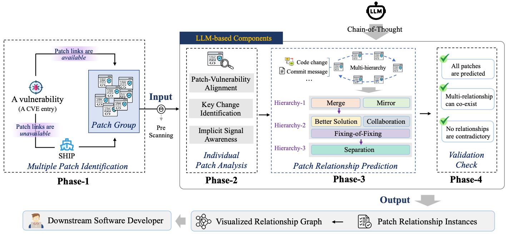
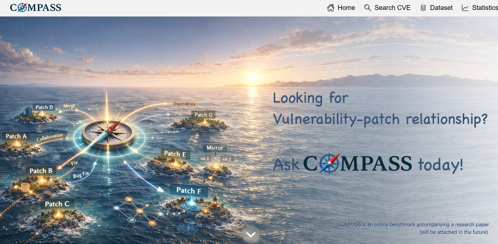
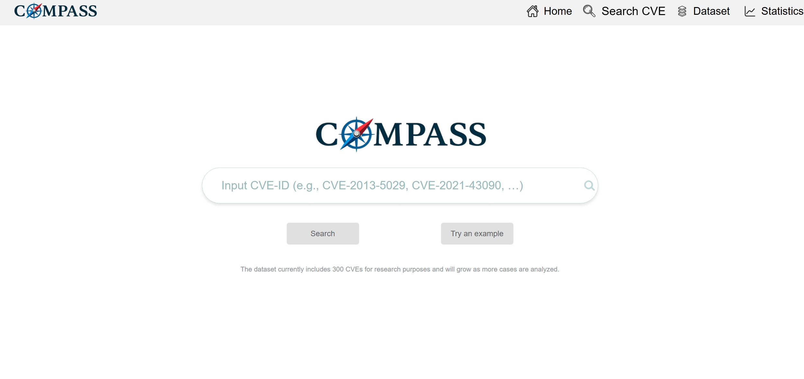
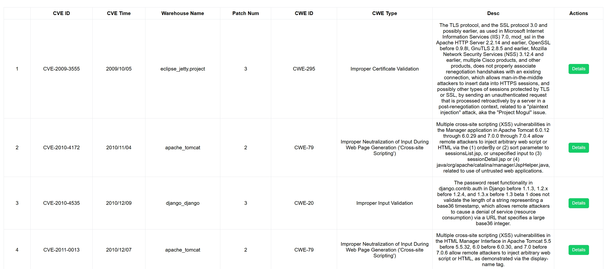
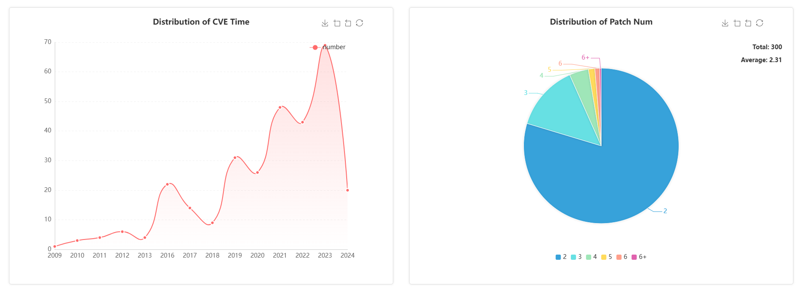
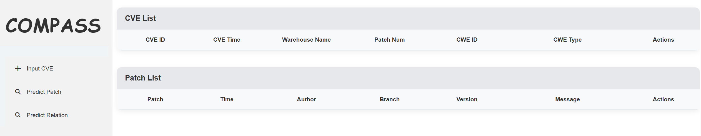

[](https://doi.org/10.5281/zenodo.19248811)

# Artifact for the Paper *COMPASS: Predicting the Relationship of Multiple Patches for Vulnerabilities with LLMs*

COMPASS is an automated approach that predicts the relationships of multiple vulnerability patches with large language models.

## Overview



- **Phase-1: Multiple Patch Identification**  
  - The method takes a vulnerability entry from public platforms (e.g., `CVE`, `NVD`, `Snyk`) as input. In many cases, these platforms explicitly record links to the patches that fix the vulnerability, allowing the required patch group to be obtained directly. In cases where such patch information is not available, COMPASS employs a previously proposed approach SHIP, to automatically search for the patch group corresponding to the vulnerability. Then, the vulnerability (including `the CVE ID` and `the description`) and its patch group (including `the commit ID`, `the branch/version information`, `the commit message`, and `the code change of each patch`) will be fed into an LLM under the intuition of chain-of-thought.
  - Source code: **[Phase1_code.py](COMPASS/Phase-1/Phase1_code.py)**.
    
- **Phase-2: Individual Patch Analysis**
  - We ask the LLM to double-check the patch group provided by the vulnerability platform or produced by SHIP, for further determining whether each patch directly fixes the vulnerability. And we also ask the LLM to identify key components and files modified, and note any special markers, to facilitate the following analysis.
  - Source code: **[Phase2_code.py](COMPASS/Phase-2/Phase2_code.py)**.

- **Phase-3: Patch Relationship Prediction**
  - We send the description of the six types of patch relationships to the LLM, divide them into three hierarchies, and prompt the LLM to perform relationship prediction.
  - Source code: **[Phase3_code.py](COMPASS/Phase-3/Phase3_code.py)**.
 
- **Phase-4: Validation Check**
  - The LLM is asked to revisit its previous predictions, ensuring that no patch is unclassified and verifying that there are no contradictory relationships. Finally, COMPASS will integrate the reasoning results of the above thinking process and then organize the output according to the predefined template, ultimately obtaining the internal relationships of the input patch group.
  - Source code: **[Phase4_code.py](COMPASS/Phase-4/Phase4_code.py)**.


## Web
**We publicly release an online querying website to support community reuse of patch-relationship knowledge (including initially-uploaded 300 CVEs and patches, as well as the relationships of patches). Please click [here](https://patch-relation.com/#/Home) to see details.**

| Page | Details | Preview | Url |
|:-:|:-:|:-:|:-:|
| Home | Overview |  | [Home](https://patch-relation.com/#/home) |
| Search CVE | A search box for CVE lookup in the dataset  |  | [Dataset](https://patch-relation.com/#/SearchCVE) |
| Dataset | A dataset of CVEs' information and Patches' relationship |  | [Dataset](https://patch-relation.com/#/CVEtable) |
| Statistic | A chart of detailed information of CVEs|  | [Statistic](https://patch-relation.com/#/CVEchart) |


## Tool
**We implement COMPASS as a tool with a visualized interface, which can be used to search multiple patches of a given CVE and predict their relationships.**


### How to use ? 
  - Prepare the python environment
```bash
activate (your env)
(your env) pip install -r requirements.txt
```

  - Use the `npm` command in `cmd` to build the required front-end environment
```bash
npm install
```

  - Start back-end service
```bash
python manage.py
```

  - Start front-end service
```bash
npm run dev
```

## Repository structure
```bash
├── *Baseline/*
│   ├── pre-trained_model_bert.py                        # BERT-based baseline
│   ├── pre-trained_model_bert_soft_prompt.py            # BERT (with soft-prompt)-based baseline
│   ├── pre-trained_model_codet5.py                      # CodeT5-based baseline
│   ├── pre-trained_model_codet5_soft_prompt.py          # CodeT5 (with soft-prompt)-based baseline
│   ├── pre-trained_model_codereviewer.py                # CodeReviewer-based baseline
│   ├── pre-trained_model_codereviewer_soft_prompt.py    # CodeReviewer (with soft-prompt)-based baseline
│
├── *COMPASS/*
│   ├── Phase-1/*
│   │   ├──Phase1_code.py              # Identifying multiple patches
│   │
│   ├── Phase-2/*
│   │   ├──Phase2_code.py              # Analyzing individual patch
│   │   ├──Phase2_prompt.py
│   │
│   ├── Phase-3/*
│   │   ├──Phase3_code.py              # Predicting patches’ relationships
│   │   ├──Phase3_prompt.py 
│   │
│   ├── Phase-4/*
│   │   ├──Phase4_code.py              # Checking the validation of patches’ relationships in predicting results
│   │   ├──Phase4_prompt.py
│
├── *Tool/*
│   ├── *build/*
│   ├── *config/*
│   ├── *data/*
│   ├── *src/*
│   ├── manage.py              #  Back-end services
│   ├── ......
|
├── *Dataset*                  # 300 CVEs with their patches' relationships
│
├── *README.md*
│
├── *Running examples.pdf*          # A step-by-step description of COMPASS by running an example vulnerability item
│
├── *Detailed examples.pdf*         # A detailed description of six typical types of relationships of patches
│
├── *Requirements.txt*              # Requirements of the running environment
```
